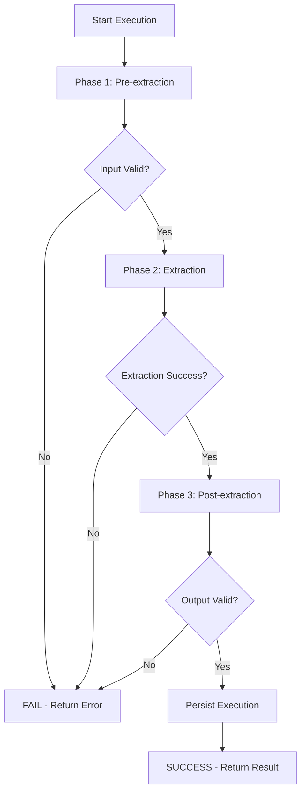

## Processing Engine - Base Processor Framework

This module provides the base processor framework for the AURA underwriting system. It implements a standardized 3-phase execution pipeline with atomic success/failure semantics.

## Architecture Overview

```
┌─────────────────────────────────────────────────────────────────┐
│                       BaseProcessor                              │
│                                                                 │
│  ┌───────────────────────────────────────────────────────────┐  │
│  │  Phase 1: Pre-extraction                                  │  │
│  │  • Prevalidate input (check documents exist, correct type)│  │
│  │  • Transform input (normalize, splice, chunk)             │  │
│  │  • Validate input (structure, required fields)            │  │
│  └───────────────────────────────────────────────────────────┘  │
│                            ↓                                    │
│  ┌───────────────────────────────────────────────────────────┐  │
│  │  Phase 2: Extraction                                      │  │
│  │  • Extract factors from validated inputs                  │  │
│  │  • Process all inputs atomically (all or nothing)         │  │
│  │  • Track processing costs                                 │  │
│  └───────────────────────────────────────────────────────────┘  │
│                            ↓                                    │
│  ┌───────────────────────────────────────────────────────────┐  │
│  │  Phase 3: Post-extraction                                 │  │
│  │  • Validate output (ensure completeness)                  │  │
│  │  • Persist execution record                               │  │
│  │  • Return processing result                               │  │
│  └───────────────────────────────────────────────────────────┘  │
└─────────────────────────────────────────────────────────────────┘
```

## Core Components

### 1. BaseProcessor (Abstract Class)

The abstract base class that all processors must extend. Provides:

- **3-Phase Execution Pipeline**: Standardized execution flow
- **Atomic Semantics**: All-or-nothing execution model
- **Cost Tracking**: Built-in cost monitoring
- **Event Dispatching**: Automatic lifecycle event emission
- **Error Handling**: Comprehensive exception handling

### 2. Execution Models

**ProcessingResult**: Contains execution status, outputs, costs, and error information
**ExecutionPayload**: Input data structure for processor execution
**ProcessorConfig**: Configuration management with database overrides
**ValidationResult**: Validation status with errors and warnings

### 3. Exception Hierarchy

```
ProcessorException (base)
├── Pre-extraction Phase
│   ├── PrevalidationError
│   ├── InputValidationError
│   └── TransformationError
├── Extraction Phase
│   ├── FactorExtractionError
│   ├── DataTransformationError
│   └── ApiError
└── Post-extraction Phase
    ├── ResultValidationError
    └── PersistenceError
```

## Creating a New Processor

### Step 1: Define Processor Class

```python
from aura.processing_engine import BaseProcessor, ProcessorType, ExecutionPayload, ValidationResult

class MyProcessor(BaseProcessor):
    # Required class constants
    PROCESSOR_NAME = "p_my_processor"
    PROCESSOR_TYPE = ProcessorType.STIPULATION  # or DOCUMENT, APPLICATION
    PROCESSOR_TRIGGERS = {
        "documents_list": ["s_my_document_type"]
    }
    CONFIG = {
        "minimum_document": 3,
        "custom_setting": "value",
    }
    PRIORITY = 10
```

### Step 2: Implement Required Methods

```python
    def transform_input(self, payload: ExecutionPayload) -> dict:
        """Transform payload into format ready for extraction"""
        # Extract relevant documents
        documents = [
            doc for doc in payload.documents_list
            if doc.get("stipulation_type") == "s_my_document_type"
        ]

        return {
            "underwriting_id": payload.underwriting_id,
            "documents": documents,
            "config": payload.config,
        }

    def validate_input(self, transformed_data: dict) -> ValidationResult:
        """Validate transformed input"""
        result = ValidationResult(is_valid=True)

        # Add validation logic
        if not transformed_data.get("documents"):
            result.add_error("No documents found")

        return result

    def extract(self, validated_data: dict) -> dict:
        """Extract factors from validated inputs"""
        documents = validated_data["documents"]

        # Your extraction logic here
        extracted_data = {}

        # Track costs
        self._add_cost(10.0, "processing")

        return extracted_data

    def validate_output(self, output: dict) -> ValidationResult:
        """Validate extraction output"""
        result = ValidationResult(is_valid=True)

        # Add output validation logic
        required_fields = ["field1", "field2"]
        for field in required_fields:
            if field not in output:
                result.add_error(f"Missing required field: {field}")

        return result
```

### Step 3: (Optional) Override should_execute

```python
    @staticmethod
    def should_execute(payload: dict) -> tuple[bool, str | None]:
        """Add custom eligibility checks"""
        documents = payload.get("documents_list", [])
        if len(documents) < 3:
            return False, "Requires minimum 3 documents"
        return True, None
```

### Step 4: (Optional) Implement Consolidation

```python
    @staticmethod
    def consolidate(executions: list[dict]) -> dict:
        """Consolidate multiple execution outputs"""
        if not executions:
            return {}

        # Aggregate across executions
        total_value = sum(e["output"].get("value", 0) for e in executions)

        return {
            "f_total_value": total_value,
            "f_execution_count": len(executions),
        }
```

## Usage Example

```python
from aura.processing_engine import BaseProcessor, ProcessorConfig, ExecutionPayload
from aura.processing_engine.processors.example_processor import BankStatementProcessor

# Create processor instance
config = ProcessorConfig(
    processor_name="p_bank_statement_processor",
    processor_type=ProcessorType.STIPULATION,
    config={"minimum_document": 3}
)

processor = BankStatementProcessor(config)

# Create execution payload
payload = ExecutionPayload(
    underwriting_id="uw_123",
    underwriting_processor_id="uwp_456",
    documents_list=[
        {
            "stipulation_type": "s_bank_statement",
            "revision_id": "rev_001",
            "uri": "gs://bucket/doc.pdf"
        },
        # ... more documents
    ]
)

# Execute processor
result = processor.execute(
    execution_id="exec_789",
    underwriting_processor_id="uwp_456",
    payload=payload
)

# Check result
if result.is_successful():
    print(f"Success! Output: {result.output}")
    print(f"Cost: ${result.total_cost_cents/100:.2f}")
else:
    print(f"Failed: {result.error_message}")
```

## Processor Types

### 1. APPLICATION Processor

Processes application form data (non-document based).

**Triggers**: `application_form` fields
**Example**: Business structure verification, location validation

### 2. STIPULATION Processor

Processes all documents of a specific stipulation type together.

**Triggers**: `documents_list` with specific `stipulation_type`
**Example**: Bank statements (analyze multiple months together)

### 3. DOCUMENT Processor

Processes each document individually.

**Triggers**: `documents_list` with specific `stipulation_type`
**Example**: Driver's license verification (each license separate)

## Execution Flow



## Atomic Execution Semantics

The processor framework implements strict atomic semantics:

- **Atomic Success**: Complete processing of ALL inputs = success
- **Atomic Failure**: ANY input failure = complete execution termination
- **No Partial Success**: System maintains transactional integrity

Example:
- Processor receives 5 documents
- Documents 1-4 process successfully
- Document 5 fails
- **Result**: Entire execution fails, no partial results saved

## Cost Tracking

Track processing costs throughout execution:

```python
def extract(self, validated_data: dict) -> dict:
    # Track API call cost
    self._add_cost(25.0, "external_api_call")

    # Track processing cost per document
    for doc in documents:
        self._add_cost(5.0, "document_processing")

    # Total cost automatically accumulated
    # Available in result.total_cost_cents
```

## Event Lifecycle

The framework automatically emits lifecycle events:

1. **`{processor_name}.execution.started`**: At execution start
2. **`{processor_name}.execution.completed`**: On successful completion
3. **`{processor_name}.execution.failed`**: On any failure

Events include:
- Execution ID
- Processor name
- Timestamp
- Duration
- Cost (for completed)
- Error details (for failed)

## Factor Consolidation

Consolidation happens AFTER execution, in the orchestrator:

```python
# Execution produces outputs
execution_output = {
    "monthly_revenue": 50000,
    "nsf_count": 2
}

# Consolidation combines outputs into factors
consolidated_factors = {
    "f_revenue_monthly_avg": 50000,
    "f_nsf_total_count": 6
}
```

**Key Points**:
- Executions produce outputs (stored in `processing_execution` table)
- Orchestrator calls `consolidate()` to create factors
- Factors written to `factor` table
- Only active executions used in consolidation

## Error Handling

### Exception Types by Phase

**Pre-extraction**:
- `PrevalidationError`: Document doesn't exist, wrong type
- `TransformationError`: Data conversion failure
- `InputValidationError`: Invalid format, missing fields

**Extraction**:
- `FactorExtractionError`: Extraction logic failure
- `ApiError`: External API failure (with retry flag)

**Post-extraction**:
- `ResultValidationError`: Output validation failure
- `PersistenceError`: Database save failure

### Handling Errors

```python
try:
    result = processor.execute(execution_id, underwriting_processor_id, payload)
except ProcessorException as e:
    # Known processor errors - already logged and handled
    # Result object contains error details
    logger.error(f"Processor failed: {e.processor_name} - {str(e)}")
```

## Best Practices

1. **Keep Extraction Atomic**: Process all inputs or fail completely
2. **Track Costs**: Add costs for all operations (API calls, processing time)
3. **Validate Thoroughly**: Validate both inputs and outputs
4. **Log Extensively**: Use provided logger for debugging
5. **Handle Errors**: Raise specific exception types for different failure modes
6. **Consolidate Smartly**: Implement processor-specific consolidation logic
7. **Test Extensively**: Test all phases independently and together

## Testing

```python
import pytest
from aura.processing_engine import ExecutionPayload

def test_processor_execution():
    processor = MyProcessor(config)
    payload = ExecutionPayload(
        underwriting_id="test_uw",
        underwriting_processor_id="test_uwp",
        documents_list=[...]
    )

    result = processor.execute("test_exec", "test_uwp", payload)

    assert result.is_successful()
    assert "expected_field" in result.output
    assert result.total_cost_cents > 0
```

## See Also

- `example_processor.py`: Complete working example
- `/docs/architecture/processing-engine.md`: Architecture details
- `@aura-processor-execution.mdc`: Cursor Rules specification

